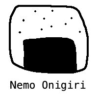

# nemo

<p align="center"></p>

A minimal split-pane markdown memo app — left editor / right preview. Single Cloudflare Worker + D1. ~$0 to run.

## Stack
- **Deploy**: Cloudflare Worker + Static Assets, D1 (SQLite), domain `nemo.roeni.ss`
- **Build**: Vite + Preact + TS, Hono API, `marked` + DOMPurify, JWT cookie auth + Turnstile
- **PWA**: installable, offline-capable (service worker + local-first storage)
- **Security**: strict CSP + security headers (`public/_headers`), sanitized markdown

## History (session snapshots)

Every memo keeps a lightweight version history, recorded server-side. There are
no read endpoints — the data is captured for recoverability and, if ever needed,
queryable directly from D1. The model is **session snapshots**: when a new
editing session begins, the prior session's final state is preserved into the
`memo_versions` table. A "new session" is detected on save (`PUT /api/memos/:id`)
as either:

- a **≥1h idle gap** since the last save (`HISTORY_GAP_MS`), or
- **continuous editing** that has run ≥1h since the last snapshot (`HISTORY_SESSION_MS`).

So a memo accrues at most ~one snapshot per hour. Empty or unchanged saves are
skipped, and a hard `?purge=1` delete drops a memo's history with it.

Both thresholds default to 1h; override them (e.g. for local dev) via the
`HISTORY_GAP_MS` / `HISTORY_SESSION_MS` worker vars in `.dev.vars`.

## External API

A separate, token-authenticated surface under `/api/ext/*` lets external clients
that can't drive the browser login (a Siri Shortcut, curl, a shell script) create
memos. It is **isolated from the web app's JWT-cookie API** and has exactly one
endpoint:

- `POST /api/ext/memos` — body `{ "content": "..." }` → creates a memo (the title
  is the first non-empty line).

Every response on this surface uses one shape — `{ "response": "<string>" }` — so a
simple client (Siri) can read a single field:

| Status | `response` | When |
| --- | --- | --- |
| `201` | `"done"` | created |
| `400` | `"content required"` | `content` missing/blank/not a string |
| `401` | `"unauthorized"` | token missing/invalid/revoked |
| `404` | `"not found"` | authenticated, but wrong method/path |

Authenticate with `Authorization: Bearer <token>`. Tokens are managed from the
in-app **⚙ Settings** page (sidebar): *Generate token* shows the plaintext **once**
(only a SHA-256 hash is stored — it can't be recovered), and *Revoke* disables it.

**curl** (use `-d "$(jq -Rs '{content: .}' < note.md)"` to send a file's contents instead of a literal):

```bash
curl -X POST https://nemo.roeni.ss/api/ext/memos \
  -H "Authorization: Bearer nemo_xxxxxxxx" \
  -H "content-type: application/json" \
  -d '{"content":"TODO: make a shower"}'
```

## Local development
```bash
npm install

# Create the D1 database (once) → put the printed database_id into wrangler.jsonc
npx wrangler d1 create nemo-db

npm run db:local            # apply schema.sql
npm run db:seed-test-user   # seed a login user (defaults: roeniss / local-dev-only)

npm run dev                 # http://localhost:5173
```
`.dev.vars` only needs `JWT_SECRET` (cookie signing). Login authenticates against
the `users` table — there are no `AUTH_*` env vars. `db:seed-test-user` inserts an
admin user, reading `TEST_USER` / `TEST_PASS` from the environment (or the
local-dev defaults above); it hashes the password the same way the worker does.

## Deploy

CI deploys automatically on push to `main` (`.github/workflows/deploy.yml`). Required GitHub secrets: `CLOUDFLARE_API_TOKEN`, `CLOUDFLARE_ACCOUNT_ID`. Optional GitHub **variable** `VITE_TURNSTILE_SITEKEY` (see Bot protection below).

Manual deploy from your machine:
```bash
npx wrangler secret put JWT_SECRET   # cookie signing (once)
npm run db:remote                    # apply schema.sql to the remote D1 (once)

# Seed the first (admin) user. Mint a salted PBKDF2 hash — the prompt is hidden
# and read from stdin, so the password never hits shell history — then INSERT it:
HASH=$(node scripts/hash-password.mjs)   # type the password at the hidden prompt
npx wrangler d1 execute nemo-db --remote --command \
  "INSERT INTO users (username, password_hash, is_admin, created_at) VALUES ('you', '$HASH', 1, CAST(strftime('%s','now') AS INTEGER) * 1000)"

npm run deploy
```
Additional users are created in-app by an admin (`POST /api/admin/users`), which
hashes the password server-side — no manual SQL needed after the first user.
The `nemo.roeni.ss` custom domain is wired via the `routes` (custom_domain) entry in `wrangler.jsonc` — the `roeni.ss` zone must be on the same Cloudflare account.

## Bot protection (Cloudflare Turnstile)

Login is protected by [Turnstile](https://developers.cloudflare.com/turnstile/).
It is **enforced only when configured**, so the app keeps working before keys are
set up. To enable it:

1. Cloudflare dashboard → Turnstile → add a widget for `nemo.roeni.ss`. Copy the
   **site key** (public) and **secret key**.
2. Set the secret as a Worker secret:
   ```bash
   npx wrangler secret put TURNSTILE_SECRET
   ```
3. Expose the site key to the build — add a GitHub Actions **variable** (not secret)
   named `VITE_TURNSTILE_SITEKEY` (Settings → Secrets and variables → Actions →
   Variables), then re-run the deploy.

Local dev: put `VITE_TURNSTILE_SITEKEY=1x00000000000000000000AA` (Cloudflare's
"always passes" test key) in `.env.local` to render the widget; leave
`TURNSTILE_SECRET` unset so the worker skips verification offline.

## Backup / recovery (D1 Time Travel)

D1 keeps an automatic point-in-time history for the last ~30 days — no setup
or export needed. If memos are lost or corrupted, restore the database:

```bash
# see available restore points (bookmarks)
npx wrangler d1 time-travel info nemo-db --remote

# restore to a timestamp or bookmark
npx wrangler d1 time-travel restore nemo-db --remote --timestamp="2026-06-05T00:00:00Z"
```
